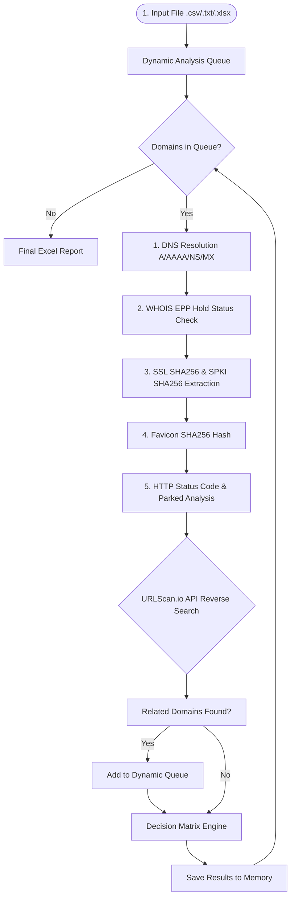

# 🛡️ Phishing Active & Correlation Tool (Domain Checker & Threat Hunter)


**Phishing Active & Correlation Tool (`dia`)** is a high-performance cybersecurity automation engine designed to analyze the active status of phishing domains targeting organization brands and users. It performs proactive **Threat Hunting** using SSL certificate fingerprints (SPKI SHA256) and Favicon hashes to discover hidden malicious infrastructure via URLScan.io.

---

## 🚀 Key Features

- **⚡ 5-Stage Automated Analysis Pipeline:**
  1. **DNS & IP Resolution:** Queries `A`, `AAAA`, `NS`, and `MX` records and resolves IPv4/IPv6 addresses.
  2. **WHOIS & Registrar Status:** Identifies legal Takedowns via `clientHold` / `serverHold` EPP status codes.
  3. **Cryptographic Fingerprinting:** Extracts SSL Certificate SHA256/SHA1, **Subject Public Key Info (SPKI SHA256)**, and **Favicon SHA256**.
  4. **HTTP & Parked Content Analysis:** Analyzes HTTP status codes, redirect chains, HTML page titles, and domain parking signatures (*Sedo, Bodis, ParkingCrew*).
  5. **Threat Hunting Loop:** Performs reverse searches via URLScan.io API using SHA256 fingerprints to uncover hidden phishing domains sharing identical infrastructure and appends them to the queue.

- **💻 Direct Command Line Execution (`dia`):** Run analyses directly in terminal using `dia -p <input_file>`.
- **📂 Dynamic File Reader:** Flexible parsing supporting `.csv`, `.txt`, and `.xlsx` files with automatic column detection and URL/protocol sanitization.
- **🔐 Automatic `.env` & Anonymous Fallback:** Reads `URLSCAN_API_KEY` automatically from `.env`. Runs seamlessly in **anonymous mode** if no API key is provided.
- **⚡ Parallel Execution:** Multithreaded engine processing multiple domain queries concurrently.
- **📊 Interactive Excel Reports:** Generates structured Excel workbooks containing an Executive Summary dashboard and detailed technical analysis sheets in the relative `./reports/` directory.

---

## 📐 Architecture Flowchart



---

## 🧩 Decision Matrix & Classification Rules

The decision engine evaluates collected technical signals to assign one of the following decisions to each domain:

| Decision Status | Technical Evaluation Criteria |
| :--- | :--- |
| **`ACTIVE`** | DNS resolved, HTTP/HTTPS returns 200/3xx, and live web content is accessible. |
| **`TAKEDOWN`** | WHOIS status includes `clientHold` / `serverHold`, or DNS resolution fails for historically active domains. |
| **`PARKED`** | DNS resolved, but page content or NameServers indicate domain parking/sale services (*Sedo, Bodis, ParkingCrew*). |
| **`INACTIVE`** | No DNS `A`/`AAAA` records found and no WHOIS hold status present (dead or expired domain). |
| **`SUSPICIOUS / UNSTABLE`** | DNS resolved, but HTTP connection times out, fails, or encounters WAF/anti-bot blocks. |

---

## ⚙️ Installation & Setup

### 1. Installation

To make `dia` runnable directly from anywhere in PowerShell / Command Prompt:

```bash
git clone https://github.com/username/domain_is_active.git
cd domain_is_active

# Global tool installation (recommended for direct 'dia' command usage):
uv tool install --editable .
```

Alternatively, install in current virtual environment:

```bash
uv pip install -e .
# Activate venv: .\.venv\Scripts\Activate.ps1
```

### 2. Configuration (`.env`)

Create a `.env` file in the project root to enable authenticated URLScan.io queries (optional):

```env
URLSCAN_API_KEY=your_urlscan_api_key_here
```

*Note: If no `.env` file or API key is found, the tool automatically performs anonymous public searches.*

---

## 🚀 Usage Guide

### Direct Command (`dia`)

```bash
# Basic usage with input file (CSV, TXT, or Excel)
dia -p scratch/test_domains.txt

# Specify custom output path
dia -p domains.txt -o reports/custom_report.xlsx

# Specify maximum correlated domains per domain
dia -p domains.xlsx -c 5
```

### Running with `uv run`

```bash
uv run dia -p scratch/test_domains.txt
```

### CLI Command Options

```text
options:
  -h, --help            Show help message and exit
  -p, --path PATH       Input file path (.csv, .txt, .xlsx) [REQUIRED]
  -o, --output OUTPUT   Excel report output path (Default: reports/phishing_analysis_report_<timestamp>.xlsx)
  -c, --max-correlated MAX_CORRELATED
                        Maximum correlated domains per domain to append to queue (Default: 3)
```

---

## 📁 Project Directory Structure

```text
domain_is_active/
├── docs/                       # Design documents and flowcharts
├── reports/                    # Generated Excel report outputs (Gitignored)
├── scratch/                    # Temporary test datasets
├── src/
│   └── domain_is_active/       # Core package source code
│       ├── __init__.py
│       ├── checker.py          # 5-Stage Local Analysis Engine
│       ├── hunter.py           # URLScan.io Threat Hunting Module (.env supported)
│       └── main.py             # CLI Orchestrator & Excel Report Generator
├── .env                        # Environment variables (API Keys)
├── AGENTS.md                   # Coding guidelines and project rules
├── pyproject.toml              # Dependencies & dia script entry point
└── README.md                   # Project documentation
```
