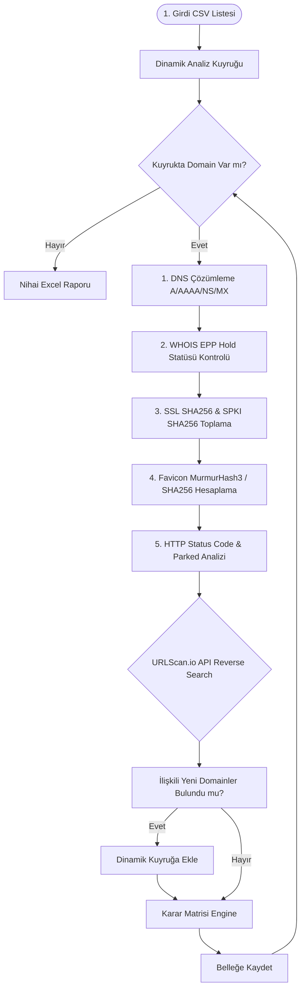

# 🛡️ Phishing Active & Correlation Tool (Domain Checker & Threat Hunter)


**Phishing Active & Correlation Tool**, kurumların marka haklarını ve kullanıcılarını hedef alan oltalama (*phishing*) alan adlarının canlılık/aktiflik durumlarını otomatik tespit eden, SSL sertifika ve Favicon parmak izleri üzerinden proaktif **Tehdit Avcılığı (Threat Hunting)** yaparak yeni zararlı altyapıları keşfeden modüler bir siber güvenlik otomasyonudur.

---

## 🚀 Öne Çıkan Özellikler

- **⚡ 5 Aşamalı Hibrit Analiz Boru Hattı:**
  1. **DNS & IP Çözümleme:** `A`, `AAAA`, `NS`, `MX` kayıtlarının sorgulanması ve IP tespiti.
  2. **WHOIS & Registrar Durumu:** `clientHold` / `serverHold` EPP durum kodları ile yasal Takedown tespiti.
  3. **Kriptografik Parmak İzi:** SSL Certificate SHA256/SHA1, **Subject Public Key Info (SPKI SHA256)** ve **Favicon MurmurHash3 / SHA256** çıkarımı.
  4. **HTTP & Parked İçerik Analizi:** HTTP Status Code, Redirect zinciri, DOM Title ve Parked Domain (satılık alan adı) tespiti.
  5. **Tehdit Avcılığı (Threat Hunting Loop):** URLScan.io API tersine arama (*reverse search*) ile aynı parmak izini paylaşan gizli phishing alan adlarının avlanması ve dinamik kuyruğa eklenmesi.

- **🔄 Dinamik Analiz Kuyruğu (Dynamic Queue):** Statik CSV okumasının ötesine geçerek tarama esnasında keşfedilen yeni alan adlarını kuyruğa otomatik ekler ve tarama kapsamını genişletir.
- **⚡ Yüksek Performanslı Multithreading:** ThreadPoolExecutor ile paralel sorgulama ve zaman aşımı (*timeout=5s*) güvencesi.
- **📊 Tıklanabilir Excel Dashboard Raporu:** Yönetici Özeti (Executive Summary) ve Detaylı Analiz sayfaları içeren, dinamik renk kodlamalı Excel çıktısı.

---

## 📐 Sistem Akış Şeması (Architecture Flowchart)



---

## 🧩 Karar Matrisi ve Sınıflandırma Mantığı

Otomasyon, toplanan teknik sinyallere göre her bir alan adı için aşağıdaki kararları üretir:

| Karar Statüsü | Değerlendirme Kriteri |
| :--- | :--- |
| **`ACTIVE (AKTIF)`** | DNS çözümlenen, HTTP/HTTPS isteklerine 200/3xx yanıt dönen ve canlı web içeriği sunan alan adları. |
| **`TAKEDOWN (KAPATILDI)`** | WHOIS kaydında `clientHold` veya `serverHold` statüsü bulunan ya da geçmişte aktif olduğu bilinmesine rağmen DNS/IP erişimi kesilmiş alan adları. |
| **`PARKED (PARK EDILMIS)`** | DNS kaydı bulunan ancak içeriğinde veya NameServer kayıtlarında park/satılık ibareleri (*Sedo, Bodis, ParkingCrew*) geçen alan adları. |
| **`INACTIVE (PASIF)`** | DNS A/AAAA kaydı bulunmayan ve WHOIS `hold` statüsü olmayan ölü/düşmüş alan adları. |
| **`SUSPICIOUS / UNSTABLE`** | DNS çözümlenmesine rağmen HTTP bağlantısı zaman aşımına uğrayan veya WAF engeline takılan durumlar. |

---

## 📁 Proje Dizin Yapısı

```text
domain_is_active/
├── docs/                       # Mimari notlar ve diyagramlar
│   ├── design_notes.md         # Tasarım ve teknik mimari kararları
│   └── flowchart.md            # Karar ve veri akış diyagramı
├── reports/                    # Zaman damgalı Excel ve Word rapor çıktıları
│   ├── phishing_analysis_report_YYYYMMDD_HHMMSS.xlsx
│   └── Phishing_Domain_Aktiflik_ve_Tehdit_Avciligi_Proje_Raporu.docx
├── src/
│   └── domain_is_active/       # Kaynak kod paketleri
│       ├── __init__.py
│       ├── checker.py          # 5 Aşamalı Lokal Analiz Motoru
│       ├── hunter.py           # URLScan.io Tehdit Avcılığı ve Korelasyon Modülü
│       └── main.py             # Orchestrator & Excel Raporlayıcı
├── AGENTS.md                   # Kodlama standartları ve kurallar
├── pyproject.toml              # Bağımlılıklar ve proje yapılandırması
└── README.md                   # Proje dokümantasyonu
```

---

## ⚙️ Kurulum ve Çalıştırma

### 1. Gereksinimler
- Python 3.9 veya üzeri
- `uv` (Önerilen hızlı paket yöneticisi) veya varsayılan `pip`

### 2. Kurulum
Projeyi klonlayın ve bağımlılıkları yükleyin:

```bash
git clone https://github.com/kullanici-adi/domain_is_active.git
cd domain_is_active

# uv ile sanal ortam ve bağımlılık kurulumu:
uv sync
```

Veya standart `pip` ile:

```bash
python -m venv .venv
source .venv/bin/activate  # Windows: .venv\Scripts\activate
pip install -r pyproject.toml
```

### 3. Girdi Veri Setini Hazırlama
Analiz edilecek alan adlarını içeren CSV dosyasının `domain` başlığı altında listelendiğinden emin olun:

```csv
domain
wyiqm-gyaaa-aaaad-qgt6q-cai.icp0.io
openakart.com
vakifbank.com.tr
```

### 4. Otomasyonu Çalıştırma

```bash
# uv kullanarak çalıştırma:
uv run python src/domain_is_active/main.py

# Standart Python ile çalıştırma:
python src/domain_is_active/main.py
```

Tarama tamamlandığında zaman damgalı sonuçlar `reports/` klasörü altına otomatik kaydedilir.

---

## 🔮 Yol Haritası ve Gelecek İyileştirmeler

- [ ] **URLScan Pro API Key Entegrasyonu:** Public rate limit kısıtlamalarını aşmak için kurumsal API key desteği.
- [ ] **Headless Browser (Playwright):** WAF/Cloudflare korumalarını aşmak, dinamik DOM işlemek ve otomatik screenshot almak.
- [ ] **Ek CTI Kaynakları:** Shodan, Censys ve SecurityTrails API entegrasyonu ile IP tabanlı SSL korelasyonu.
- [ ] **Otomatik Alarm & Webhook:** ACTIVE tespit edilen zararlı domainlerin anlık Slack / Teams / SIEM entegrasyonu.

---

## 📝 Lisans ve İletişim

Bu proje MIT lisansı altında lisanslanmıştır.

- **Geliştirici:** İsa Murat Cireli
- **Rol:** Siber Güvenlik Analisti / Stajyer
