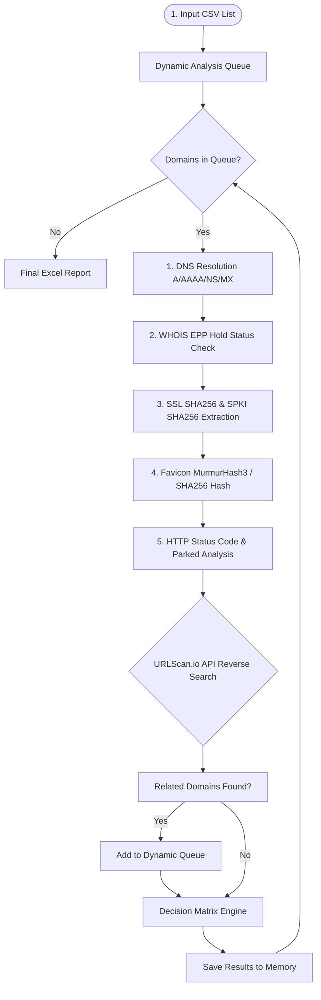

# 🛡️ Phishing Active & Correlation Tool (Domain Checker & Threat Hunter)


**Phishing Active & Correlation Tool** is a modular cybersecurity automation tool designed to detect the active status of phishing domains targeting organization brands and users. It proactively performs **Threat Hunting** via SSL certificate fingerprints and Favicon hashes to discover previously unknown malicious infrastructure.

---

## 🚀 Key Features

- **⚡ 5-Stage Automated Analysis Pipeline:**
  1. **DNS & IP Resolution:** Queries `A`, `AAAA`, `NS`, and `MX` records and resolves IP addresses.
  2. **WHOIS & Registrar Status:** Identifies legal Takedowns via `clientHold` / `serverHold` EPP status codes.
  3. **Cryptographic Fingerprinting:** Extracts SSL Certificate SHA256/SHA1, **Subject Public Key Info (SPKI SHA256)**, and **Favicon MurmurHash3 / SHA256**.
  4. **HTTP & Parked Content Analysis:** Analyzes HTTP status codes, redirect chains, DOM titles, and parked domain signatures.
  5. **Threat Hunting Loop:** Performs reverse searches via the URLScan.io API using SHA256 fingerprints to uncover hidden phishing domains sharing identical infrastructure and dynamically adds them to the scanning queue.

- **🔄 Dynamic Queue Management:** Expands scanning coverage dynamically by automatically appending newly discovered domains to the queue during runtime.
- **⚡ High-Performance Multithreading:** Powered by `ThreadPoolExecutor` for parallel querying with timeout protection (`timeout=5s`).
- **📊 Interactive Excel Reports:** Generates structured Excel workbooks containing an Executive Summary dashboard and detailed technical analysis sheets.

---

## 📐 Architecture Flowchart



---

## 🧩 Decision Matrix & Classification Rules

The decision engine evaluates collected technical signals to assign one of the following decisions to each domain:

| Decision Status | Technical Evaluation Criteria |
| :--- | :--- |
| **`ACTIVE`** | DNS resolved, HTTP/HTTPS returns 200/3xx, and live phishing web content is detected. |
| **`TAKEDOWN`** | WHOIS status includes `clientHold` / `serverHold`, or DNS/IP resolution fails for historically active domains. |
| **`PARKED`** | DNS resolved, but content or NameServers indicate domain parking/sale services (*Sedo, Bodis, ParkingCrew*). |
| **`INACTIVE`** | No DNS `A`/`AAAA` records found and no WHOIS hold status present (dead or expired domain). |
| **`SUSPICIOUS / UNSTABLE`** | DNS resolved, but HTTP connection times out, fails, or encounters WAF/anti-bot blocks. |

---

## 📁 Project Directory Structure

```text
domain_is_active/
├── docs/                       # Architecture notes and flowcharts
│   ├── design_notes.md         # System design & architectural decisions
│   └── flowchart.md            # Data flow and decision diagrams
├── reports/                    # Generated report outputs (gitignored)
├── src/
│   └── domain_is_active/       # Core package source code
│       ├── __init__.py
│       ├── checker.py          # 5-Stage Local Analysis Engine
│       ├── hunter.py           # URLScan.io Threat Hunting & Correlation Module
│       └── main.py             # Orchestrator & Excel Report Generator
├── AGENTS.md                   # Coding standards and guidelines
├── pyproject.toml              # Dependencies and project configuration
└── README.md                   # Project documentation
```

---

## ⚙️ Installation & Usage

### 1. Prerequisites
- Python 3.9 or higher
- `uv` (Recommended fast package manager) or standard `pip`

### 2. Installation
Clone the repository and install dependencies:

```bash
git clone https://github.com/username/domain_is_active.git
cd domain_is_active

# Using uv (recommended):
uv sync
```

Or using standard `pip`:

```bash
python -m venv .venv
source .venv/bin/activate  # On Windows: .venv\Scripts\activate
pip install -r pyproject.toml
```

### 3. Preparing Input Dataset
Ensure your input CSV file contains a `domain` column header:

```csv
domain
wyiqm-gyaaa-aaaad-qgt6q-cai.icp0.io
openakart.com
vakifbank.com.tr
```

### 4. Running the Automation

```bash
# Running with uv:
uv run python src/domain_is_active/main.py

# Running with standard Python:
python src/domain_is_active/main.py
```

Upon completion, time-stamped report files are saved automatically in the `reports/` directory.
