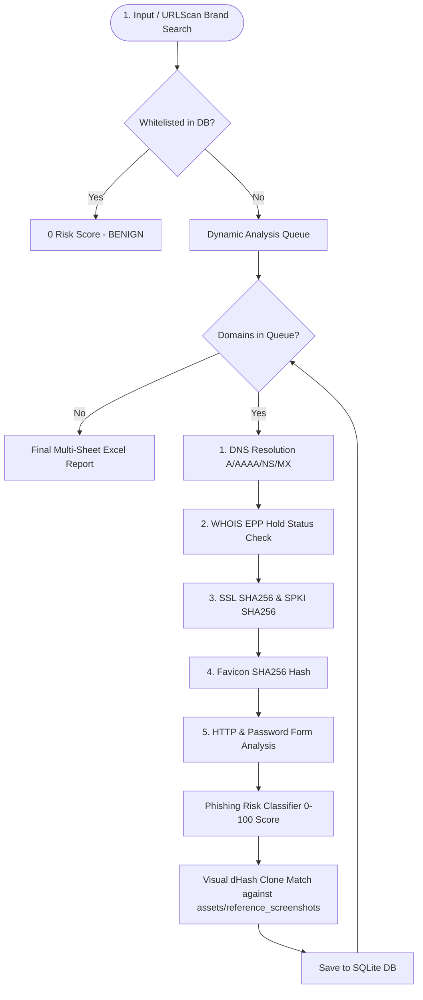

# 🛡️ Phishing Active & Correlation Tool (Domain Checker & Threat Hunter)


**Phishing Active & Correlation Tool (`dia`)** is a high-performance cybersecurity threat intelligence and phishing analysis engine. It performs proactive **Threat Hunting** across 11 target institutions (Garanti, Togg, A101, Vakıfbank, İş Bankası, Borsa İstanbul, Takasbank, Otokoç, Azercell, BIDV, The Body Shop) via URLScan.io, executes 0-100 weighted **Phishing Risk Scoring**, offers **Visual dHash Screenshot Clone Detection**, and protects legitimate sites via a **Database Whitelist Table**.

---

## 🚀 Key Features

- **⚡ 5-Stage Automated Analysis Pipeline:**
  1. **DNS & IP Resolution:** Queries `A`, `AAAA`, `NS`, and `MX` records and resolves IPv4/IPv6 addresses.
  2. **WHOIS & Registrar Status:** Identifies legal Takedowns via `clientHold` / `serverHold` EPP status codes.
  3. **Cryptographic Fingerprinting:** Extracts SSL Certificate SHA256/SHA1, **Subject Public Key Info (SPKI SHA256)**, and **Favicon SHA256**.
  4. **HTTP & HTML Form Analysis:** Analyzes HTTP status codes, redirect chains, page titles, `<input type="password">` presence, and login forms.
  5. **Threat Hunting Loop:** Performs reverse searches via URLScan.io API using SHA256 fingerprints to uncover hidden phishing domains sharing identical infrastructure.

- **🎯 Brand-Based URLScan Threat Hunter (`dia -bh`):**
  - Performs proactive daily/hourly threat hunting on URLScan.io targeting **11 specific institutions** (A101, Togg, Borsa İstanbul, Garanti Bankası, Vakıfbank, İş Bankası, Takasbank, Otokoç, Azercell, BIDV, The Body Shop).

- **🧠 Phishing Risk Classifier Engine (0-100 Weighted Score):**
  - **HTML Form Analyzer:** Evaluates password inputs and login form presence (+40 pts).
  - **Lexical Typosquatting Analyzer:** Detects brand spoofing and Levenshtein string distance (+25 pts).
  - **WHOIS & SSL Analyzer:** Evaluates domain age, hold status, and DV vs OV/EV SSL certs.
  - **Visual Clone Analyzer (`dHash`):** Compares candidate screenshots against legitimate site reference images in `assets/reference_screenshots/` using Perceptual Difference Hashing (dHash) and Hamming Distance ($\le 10$ bits / $>85\%$ similarity).

- **🗄️ Database Whitelist Protection (`whitelist_domains`):**
  - Legitimate institution domains are stored in a SQLite database table and cached in memory ($O(1)$ lookup speed).
  - Add or list whitelisted domains directly via CLI (`dia --add-whitelist`, `dia --list-whitelist`).

- **📊 Interactive Multi-Sheet Excel Reports:** Generates structured Excel workbooks containing an Executive Summary dashboard, Technical Analysis, and Phishing Risk Assessments.

---

## 📐 Architecture Flowchart


```mermaid
graph TD
    Start([1. Input / URLScan Brand Search]) --> Whitelist{Whitelisted in DB?}
    Whitelist -- Yes --> Benign[0 Risk Score - BENIGN]
    Whitelist -- No --> Queue[Dynamic Analysis Queue]
    
    Queue --> Pop{Domains in Queue?}
    Pop -- No --> Excel[Final Multi-Sheet Excel Report]
    
    Pop -- Yes --> DNS[1. DNS Resolution A/AAAA/NS/MX]
    DNS --> WHOIS[2. WHOIS EPP Hold Status Check]
    WHOIS --> SSL[3. SSL SHA256 & SPKI SHA256]
    SSL --> Favicon[4. Favicon SHA256 Hash]
    Favicon --> HTTP[5. HTTP & Password Form Analysis]
    
    HTTP --> RiskEngine[Phishing Risk Classifier 0-100 Score]
    RiskEngine --> Visual[Visual dHash Clone Match against assets/reference_screenshots]
    Visual --> DB[Save to SQLite DB]
    DB --> Pop
```

---

## ⚙️ Installation & Setup

### 1. Installation

```bash
git clone https://github.com/isa-murat/domain_is_active.git
cd domain_is_active

# Install editable package via uv:
uv pip install -e .
```

### 2. Database Migrations (Alembic)

Initialize SQLite database schema and seed initial Whitelist table:

```bash
uv run alembic upgrade head
```

### 3. Configuration (`.env`)

Create a `.env` file in the project root to enable authenticated URLScan.io queries:

```env
URLSCAN_API_KEY=your_urlscan_api_key_here
```

---

## 🖼️ Reference Screenshots Setup

Place official/legitimate site reference login screenshots into the designated asset folder:

📁 **`assets/reference_screenshots/`**

Simply name the file after the brand name (e.g. `brand_name.png` or `brand_name.jpg`):
- `brand_name.png` (e.g. your official institution login page screenshot)

*The Visual Risk Analyzer will automatically compute dHashes for all images in this folder and flag any candidate site showing >85% visual similarity.*

---

## 🚀 Usage Guide

### 1. Brand Threat Hunting (11 Institutions)

```bash
# Hunt for phishing domains targeting the 11 institutions from the last 48 hours:
dia -bh --hours 48

# Hunt and reset database results:
dia -bh --reset-db
```

### 2. Domain List File Analysis

```bash
# Analyze a CSV, TXT, or Excel list of candidate domains
dia -p scratch/test_domains.txt
```

### 3. Whitelist Management (Database)

```bash
# Add a new legitimate domain to SQLite whitelist_domains table:
dia --add-whitelist meşru-kurum.com.tr

# List all whitelisted domains in database:
dia --list-whitelist
```

---

## 📁 Project Directory Structure

```text
domain_is_active/
├── assets/
│   └── reference_screenshots/ # Official brand reference images (png/jpg)
├── docs/                      # Memory Bank & design documents
├── migrations/                # Alembic database migration scripts
├── reports/                   # Generated Excel report outputs
├── src/
│   ├── core/                  # Database engine & BaseRepository
│   ├── domain_is_active/      # Active scanning & Threat hunting engine
│   │   ├── collectors/        # DNS, WHOIS, SSL, HTTP, Visual collectors
│   │   ├── hunting/           # Multi-Vector & BrandHunter modules
│   │   ├── main.py            # CLI Orchestrator
│   │   └── repository.py      # SQLite Scan repositories
│   └── phishing_classifier/   # 0-100 Phishing Risk Scoring Engine
│       ├── classifier/        # HTML, Lexical, WHOIS, SSL risk analyzers
│       ├── visual/            # Visual dHash Clone Risk Analyzer
│       ├── repository.py      # Whitelist & Assessment DB Repositories
│       └── whitelist.py       # In-Memory DB Whitelist Manager
├── AGENTS.md                  # Project standards and coding rules
├── pyproject.toml             # Package dependencies and dia CLI entrypoint
└── README.md                  # Project documentation
```
