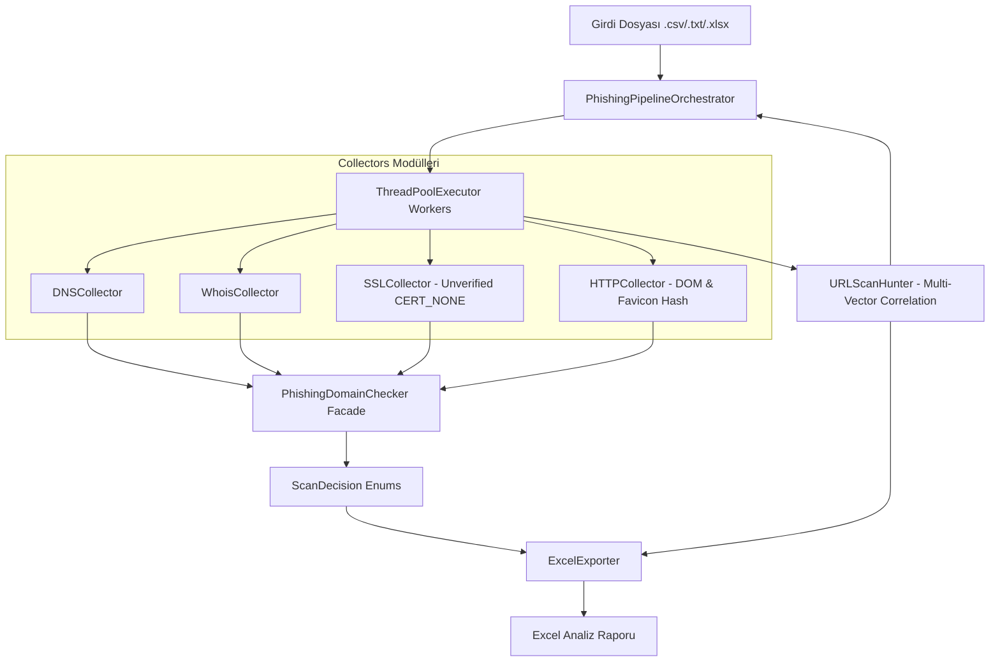

# Phishing Active & Correlation Tool - Sistem Mimarısı Dokümantasyonu (v0.1.0+)

Bu doküman, **`domain_is_active`** projesinin modüler mimarisini, veri akışını, bileşenlerini ve geliştirme standartlarını tanımlar.

---

## 1. Mimari Genel Bakış (Architecture Overview)

`domain_is_active`, şüpheli/phishing alan adlarının canlılık durumunu (A/AAAA DNS, WHOIS hold, SSL geçerliliği, HTTP yanıtı) analiz eden ve URLScan.io üzerinden çok vektörlü (Favicon, SSL SPKI, IP, DOM Hash) tehdit avcılığı yapan yüksek performanslı ve modüler bir Python kütüphanesidir.



---

## 2. Klasör ve Modül Yapısı

```text
src/domain_is_active/
├── checker/             # Domain Aktiflik Karar Kontrolcüsü (Facade)
│   ├── __init__.py
│   └── domain_checker.py# PhishingDomainChecker sınıfı
├── collectors/          # Bağımsız Veri Toplayıcı Modüller
│   ├── __init__.py
│   ├── dns_col.py       # A, AAAA, NS, MX DNS kayıtları
│   ├── whois_col.py     # WHOIS hold & status kontrolcüsü
│   ├── ssl_col.py       # CERT_NONE ile SSL parmak izi & SPKI çıkarıcı
│   ├── http_col.py      # HTTP status, title, favicon & DOM body hash
│   └── visual_col.py    # Ekran görüntüsü dHash/pHash hesaplama
├── constants/           # Merkezi Enum ve Sabitler Katmanı
│   ├── __init__.py
│   ├── enums.py         # ScanDecision, HuntingVector, ReportColors
│   └── defaults.py      # Timeout, User-Agent ve Ignorelist sabitleri
├── exporters/           # Raporlama Modülleri
│   ├── __init__.py
│   └── excel.py         # openpyxl biçimlendirmeli Excel üretici
├── hunting/             # Tehdit Avcılığı & Korelasyon Modülleri
│   ├── __init__.py
│   ├── urlscan_hunter.py# Multi-Vector (IP, SPKI, Favicon, DOM) URLScan arayıcı
│   └── similarity.py    # Levenshtein string benzerlik hesaplayıcı
└── main.py              # CLI arayüzü ve PhishingPipelineOrchestrator
```

---

## 3. Önemli Teknik Kararlar ve Düzeltmeler (Key Design Decisions)

### A. Merkezi Enums (`constants/enums.py`)
- Hardcoded metin ifadeleri kaldırılmıştır. Kararlar (`ScanDecision.ACTIVE`, `ScanDecision.TAKEDOWN`), renk kodları (`ReportColors.TITLE_BG`) ve avcılık parametreleri (`HuntingVector.SPKI`) tip güvenli Enum sınıflarında toplanmıştır.

### B. Self-Signed / Unverified SSL Fix (`collectors/ssl_col.py`)
- Phishing sitelerindeki geçersiz SSL sertifikalarının exception fırlatarak SPKI hash'ini engellemesini önlemek için `ssl.SSLContext(CERT_NONE)` kullanılmıştır. Sertifika güvenilir olmasa dahi SPKI parmak izi %100 oranında çıkarılır.

### C. Multi-Vector Threat Hunting (`hunting/urlscan_hunter.py`)
- Korelasyon araması tek parametre yerine **Favicon SHA256 + SSL SPKI + IP Adresi (`page.ip`) + HTML DOM Body Hash** sinyallerini birleştirerek yapılır.

### D. Single ThreadPool Lifecycle (`main.py`)
- `ThreadPoolExecutor` döngünün dışında TEK bir kez oluşturulur. Thread churn ve bellek overhead'i engellenmiştir.

---

## 4. CLI Kullanımı (`dia`)

Paket kurulduğunda `dia` kısayolu ile doğrudan komut satırından çalıştırılabilir:

```powershell
# Temel Kullanım:
dia -p "girdi_listesi.txt" -o "rapor_sonucu.xlsx"

# Parametreli Kullanım (15 Thread, Domain başı max 10 ilişkili domain):
dia -p "girdi_listesi.txt" -o "rapor_sonucu.xlsx" -c 10 -t 15

# Limitsiz Avcılık Modu:
dia -p "girdi_listesi.txt" -o "rapor_sonucu.xlsx" -c 0
```

---

## 5. Gelecek Yol Haritası (Roadmap)

1. **`feat/sqlite-alembic-db`:** SQLite veritabanı entegrasyonu ve Alembic migrasyon altyapısı.
2. **`feat/phishing-risk-classifier`:** Bağımsız Phishing Risk Skorlama (0-100) ve Sınıflandırma motoru.
3. **`feat/visual-phash-analyzer`:** URLScan ekran görüntülerini `pHash` ile işleyip marka klonu tespit eden modül.
