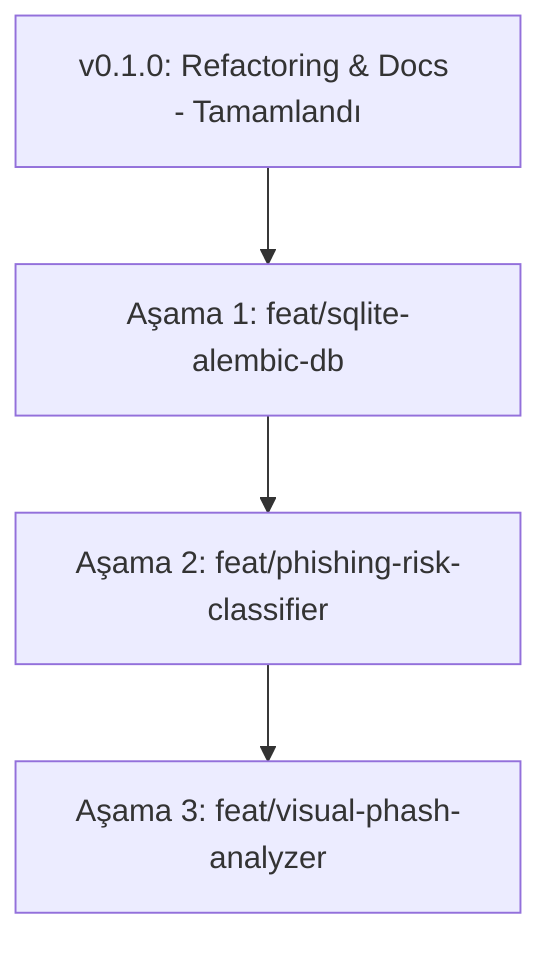

# Memory Bank - Geliştirme Yol Haritası (roadmap.md)

Bu doküman, projenin sonraki sürümlerinde adım adım açılacak özellik branch'lerini ve yapılacak işleri tanımlar.

---

## 🛣️ Aşama Aşama Geliştirme Planı

### 🔹 Aşama 1: Veritabanı ve Migrasyon Altyapısı (`feat/sqlite-alembic-db`)
- **Amaç:** Tarihsel tarama takibi ve 300+ domain analizinde performans sağlamak.
- **Yapılacaklar:**
  - SQLite veritabanı entegrasyonu.
  - Alembic migrasyon araçlarının yapılandırılması.
  - Modüller arası tablo ayrımı (`active_domain_scans`, `active_scan_history`).

### 🔹 Aşama 2: Phishing Sınıflandırma Motoru (`feat/phishing-risk-classifier`)
- **Amaç:** `domain_is_active` modülünden tamamen bağımsız, Phishing / Legitimate sınıflandırması yapan 0-100 Puanlık Risk Engine.
- **Yapılacaklar:**
  - 0-100 Ağırlıklı Risk Puanlama Motoru (`phishing_classifier`).
  - Görsel, DOM, Ağ ve Leksikal (Typosquatting) özellik vektörlerinin işlenmesi.
  - Whitelist (Tranco Top 10K) muafiyet mekanizması.

### 🔹 Aşama 3: Görsel Analiz & Klon Tespiti (`feat/visual-phash-analyzer`)
- **Amaç:** URLScan ekran görüntülerini Perceptual Hashing (dHash/pHash) ile işleyip marka klonlarını tespit etmek.
- **Yapılacaklar:**
  - Hedef marka referans pHash şablon kütüphanesi.
  - Görsel Benzerlik > %85 ise `VISUAL_CLONE_PHISHING` tespiti.
