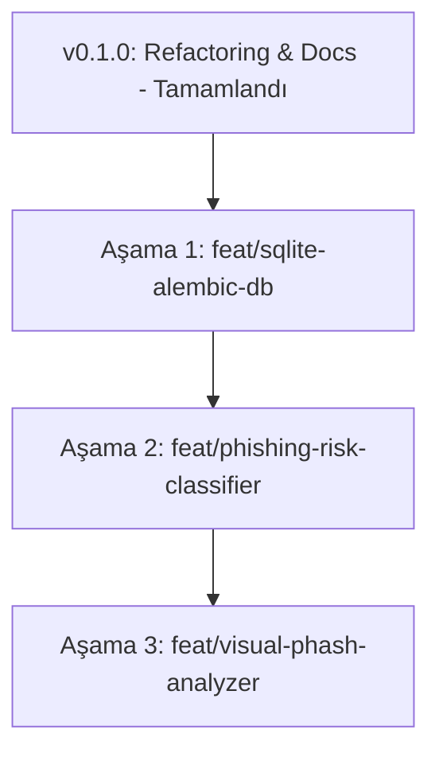

# Memory Bank - Geliştirme Yol Haritası (roadmap.md)

Bu doküman, projenin sonraki sürümlerinde adım adım açılacak özellik branch'lerini ve yapılacak işleri tanımlar.

---

## 🛣️ Aşama Aşama Geliştirme Planı

```mermaid
graph TD
    A[v0.1.0: Refactoring & Docs - Tamamlandı] --> B[Aşama 1: feat/sqlite-alembic-db]
    B --> C[Aşama 2: feat/phishing-risk-classifier]
    C --> D[Aşama 3: feat/visual-phash-analyzer]
```

### 🔹 Aşama 1: Veritabanı ve Migrasyon Altyapısı (`feat/sqlite-alembic-db`)
- **Amaç:** Tarihsel tarama takibi ve 300+ domain analizinde performans sağlamak.
- **Yapılacaklar:**
  - SQLite veritabanı entegrasyonu.
  - Alembic migrasyon araçlarının yapılandırılması.
  - Modüller arası tablo ayrımı (`active_domain_scans`, `active_scan_history`).

### 🔹 Aşama 2: Phishing Sınıflandırma Motoru (`feat/phishing-risk-classifier`) [DEVAM EDİYOR]
- **Amaç:** `domain_is_active` modülünden tamamen bağımsız, toplanan veri vektörlerini işleyip Phishing / Legitimate sınıflandırması yapan 0-100 Puanlık Risk Engine (`src/phishing_classifier/`).
- **Yapılacaklar:**
  - `src/phishing_classifier/` paketi oluşturulacak.
  - **0-100 Ağırlıklı Risk Puanlama Motoru (`PhishingRiskClassifier`):**
    - `HTMLRiskAnalyzer`: HTML şifre kutusu (`type="password"`), login form varlığı ve cross-domain / harici `form action` hedeflerinin analizi.
    - `LexicalRiskAnalyzer`: Typosquatting tespiti (Levenshtein mesafe/oranı, marka adı taklidi, TLD swap, tire/karakter ekleme).
    - `WhoisRiskAnalyzer`: WHOIS sinyalleri (yeni kayıt < 30 gün, gizlilik koruması/privacy proxy, eksik registrar).
    - `SSLNetworkRiskAnalyzer`: SSL sertifika yaş/türü (Let's Encrypt / DV vs OV/EV, süresi dolmuş/self-signed sertifika, açık yönlendirme / IP redirect).
  - **Whitelist Muafiyet Mekanizması (`WhitelistManager`):**
    - Tranco / Umbrella Top 10K meşru domain listesi entegrasyonu (offline dosya + opsiyonel bellek önbelleği).
    - Whitelist eşleşmesinde risk puanı 0'a çekilerek `RiskLevel.BENIGN` dönecek.
  - **Veritabanı Entegre Modelleri ve Repository (`PhishingRiskAssessment` & `PhishingRiskRepository`):**
    - Ortak DB altyapısı (`src/core/db/`) kullanılarak risk skorları, risk seviyeleri ve detaylı sinyal analiz çıktılarının kaydedilmesi.

### 🔹 Aşama 3: Görsel Analiz & Klon Tespiti (`feat/visual-phash-analyzer`)
- **Amaç:** URLScan ekran görüntülerini Perceptual Hashing (dHash/pHash) ile işleyip marka klonlarını tespit etmek.
- **Yapılacaklar:**
  - Hedef marka referans pHash şablon kütüphanesi.
  - Görsel Benzerlik > %85 ise `VISUAL_CLONE_PHISHING` tespiti.
